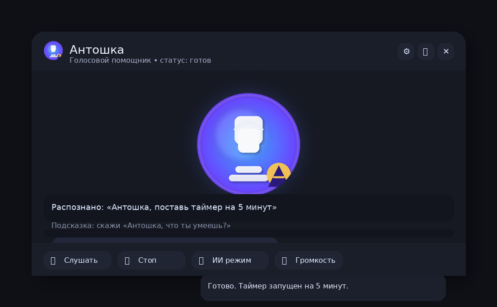

# Antoshka

Voice assistant with CLI and desktop UI.

## Release Status

- Current channel: **Alpha**
- Intended use: demo/defense and limited pilot usage
- Not yet intended for production-critical workflows

### Alpha Notes

- Preferred build for end users: folder build (`dist/AntoshkaApp/AntoshkaApp.exe`)
- Onefile build may fail on some Windows setups before Python starts (bootloader temp extraction issue)
- If onefile fails, use folder build or installer package from `release/`

## Compatibility

| Item | Status |
| --- | --- |
| OS | Windows 10/11 (x64) |
| Python required for end users | No (use release package) |
| Internet required | Optional (required only for online features like LLM/weather) |
| Microphone required | Optional (text mode works without mic) |

## Quick Start (Defense)

```powershell
.\dist\AntoshkaApp\AntoshkaApp.exe --self-test
.\dist\AntoshkaApp\AntoshkaApp.exe --smoke
.\dist\AntoshkaApp\AntoshkaApp.exe
```

## For Defense / Demo

Recommended package:

- `release/AntoshkaApp_installer_ready.zip`

Quick demo checks:

1. Launch app
2. Run `--self-test` (headless)
3. Run `--smoke` (headless)
4. Show RU/EN switch + timer + help



## Run

CLI:

```bash
python antoshka.py
```

UI:

```bash
python antoshka_ui.py
```

## Guides

- User guide: `docs/USER_GUIDE.md`
- Developer guide: `docs/DEVELOPER_GUIDE.md`
- Changelog: `CHANGELOG.md`
- License: `LICENSE`
- Security policy: `SECURITY.md`
- Support and troubleshooting: `SUPPORT.md`
- Release notes template: `release/release_notes_template.md`

## First Run (Windows)

If you get UnicodeEncodeError in console, run:

```powershell
chcp 65001
$env:PYTHONIOENCODING="utf-8"
```

To avoid microphone/Vosk issues on the first run, set in `config/settings.json`:

```json
{
  "stt": {"mode": "text"},
  "ui": {"wake_word": false}
}
```

## STT/TTS

- Text mode uses console input (CLI only).
- For microphone use Vosk: download a model into `models/vosk` and set `stt.mode` to `vosk` in `config/settings.json`.
- TTS settings are in `config/settings.json` (provider/voice/rate/pitch).
- On Windows, `edge-tts` is used automatically when available (recommended).

## LLM

Set `OPENAI_API_KEY` in `.env` and `llm.provider` to `openai` in `config/settings.json`.
If the key is missing or looks like a placeholder, UI shows a clear diagnostic message and falls back to local commands.

## Wake Word

- Enable in Settings: `Wake word: on`.
- Phrase: "antoshka slushay" (translit).
- Requires Vosk model and microphone permissions.

## Notifications (Windows)

- System notifications are shown for timers/alarms/reminders when enabled in Settings.
- Optional tray duplication (fallback) can be enabled for reliability.
- In-app alert handling includes a dedicated Alert Popup with controls.
- If notifications are blocked, enable them in Windows Settings:
  `Settings > System > Notifications > Antoshka`.
- Clicking a notification restores the app window.

## Presentation Brief

- `docs/PRESENTATION_BRIEF.md` — краткое описание продукта, FAQ и демо‑сценарии для защиты.

## Alerts UI (Timers/Alarms/Reminders)

When an alert fires, the UI shows:

- Alert card in chat with action buttons.
- Optional **Alert Popup** (always on top) with Snooze/Stop/Repeat.

Settings (UI):

- `Alerts > Alert popup window` (enable/disable)
- `Alerts > Auto-close (sec)` (0 = disable)
- `Alerts > Duplicate via tray (fallback)` (recommended ON)

Notes:

- The Alert Popup appears centered and can be dragged with the mouse.
- Buttons are always visible, even on small windows.

## Tests

```bash
pytest
```

Smoke-test (CLI, no GUI):

```bash
python tools/smoke_test.py
```

## Build (Windows)

```bash
python -m pip install -r requirements.txt
python -m pip install -r requirements-dev.txt
python -m PyInstaller Antoshka_pyinstaller.spec
```

One-file:

```bash
python -m PyInstaller Antoshka_onefile.spec
```

One-file debug (console):

```bash
python -m PyInstaller Antoshka_onefile_debug.spec
```

## Release Build (Windows)

Recommended:

```powershell
.\build.ps1
```

Onefile:

```powershell
.\build_onefile.ps1
```

Artifacts:

- `dist/AntoshkaApp/AntoshkaApp.exe`
- `dist/AntoshkaApp_Windows.zip`
- `dist/Antoshka_onefile.exe`
- `dist/Antoshka_onefile_debug.exe`

Self-test:

```powershell
.\dist\AntoshkaApp\AntoshkaApp.exe --self-test
.\dist\Antoshka_onefile.exe --self-test
```

Smoke:

```powershell
.\dist\AntoshkaApp\AntoshkaApp.exe --smoke
.\dist\Antoshka_onefile.exe --smoke
```

Self-test report: `logs/pre_release_report.txt` (or рядом с exe)

If onefile does not start:

1. Move exe to `C:\Antoshka\` (latin-only path).
2. Check write access to `%TEMP%` and `%LOCALAPPDATA%\Temp`.
3. Temporarily disable SmartScreen/Defender blocking for this exe.
4. Run debug build and send console output:
   `.\dist\Antoshka_onefile_debug.exe --self-test`

## Known Issues

- Onefile package can fail before Python starts with `Failed to create parent directory structure`.
- If onefile fails, use folder build or installer package.
- On some systems Windows Defender/SmartScreen may block first launch until manually allowed.

## Ready Package For Friend

Recommended for transfer/use (no Python required):

- `release/AntoshkaApp_friend_ready.zip` (portable folder build)
- `release/AntoshkaApp_installer_ready.zip` (no-admin installer package)

Installer package usage:

1. Unzip `release/AntoshkaApp_installer_ready.zip`
2. Run `install.bat`
3. Launch app from desktop shortcut `Antoshka`
4. Uninstall with `uninstall.bat`

## Privacy and Data

- Local app data path: `%LOCALAPPDATA%\Antoshka\`
- Logs path: `%LOCALAPPDATA%\Antoshka\logs\` (or `logs/` near app for some runs)
- History path: `%LOCALAPPDATA%\Antoshka\data\history.json`
- API keys are read from environment (`OPENAI_API_KEY`) and must not be hardcoded into the app
